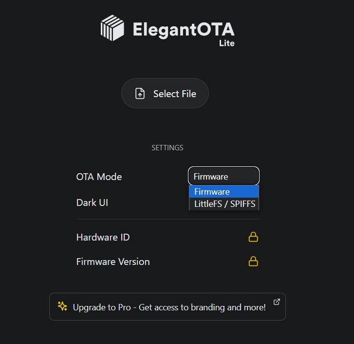

# ECG PROJECT FIRMWARE
## Last Version
- V2.2.2 (HW Version)
- V2.2.5 (SW Version)

## Changelog
- Optimized client buffer sizes for API communication (ESP8266).
- Modified change-url-api.html page (ESP8266).
- Fixed SDCard program and optimized ArduinoJson library usage.

## Uploader Aplication

Use the Uploader App if you want to upload firmware files on atmega328p (uno) and esp8266

- Arduino Uno : <a href="https://drive.google.com/drive/folders/1Jd0Euq1-ti-_1vtQXpMNdb4uExqVydhc?usp=sharing" target="-blank">Download</a>
- Esp8266     : Flashing with OTA Library (Elegant OTA). "Please upload the Elegant OTA library program first in the Arduino IDE -> <a href="https://youtu.be/LDk_tKrHIdI?si=OgcLtV9RhKXbJCEk" target="-blank">Tutorial</a> or <a href="https://github.com/N1zam/ECG-Project-Firmware/blob/V2.2.2.5/esp8266/program_ota/program_ota.ino" target="-blank">Program</a>"

## Steps upload firmware for Software WebServer
- set enable recovery mode and set AP mode on settings
- open /update on browser

    

- set OTA Mode : LittleFS/SPIFFS
- select file ecg-v2-2.2.4-esp8266-littlefs.bin
- auto reboot and click back (or reopen /update)
- set OTA Mode : Firmware
- select file ecg-v2-2.2.4-esp8266-firmware.bin
- auto reboot and finish

<h2 align=center><a href="https://github.com/N1zam/ECG-Project-Firmware/archive/refs/tags/2.2.2.5.zip">Download Firmware Here</a></h2>